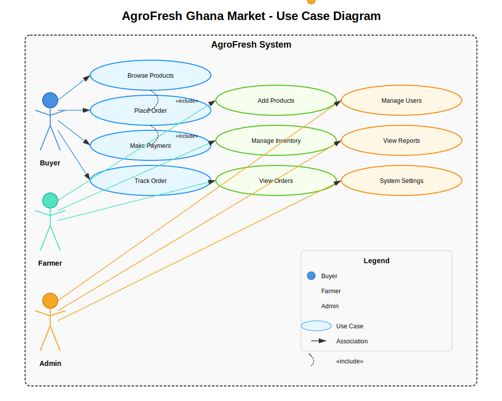

# AgroFresh Ghana Market - Comprehensive Documentation

## Table of Contents
1. [Introduction](#introduction)
2. [Problem Statement](#problem-statement)
3. [Implementation Requirements](#implementation-requirements)
4. [User Personas](#user-personas)
5. [User Scenario](#user-scenario)
6. [System Architecture](#system-architecture)
7. [Development Methodology](#development-methodology)
8. [Code Samples](#code-samples)
9. [Conclusion](#conclusion)
10. [Appendices](#appendices)

## Introduction
AgroFresh Ghana Market is an innovative e-commerce platform designed to bridge the gap between Ghanaian farmers and buyers. The platform facilitates direct transactions, eliminating middlemen and ensuring fair prices for both farmers and consumers. Built with modern web technologies, it provides a seamless experience for users to buy and sell agricultural produce.

## Problem Statement
Small-scale farmers in Ghana face significant challenges in reaching wider markets and obtaining fair prices for their produce. Traditional supply chains involve multiple intermediaries, leading to:
- Reduced profits for farmers
- Higher prices for consumers
- Food wastage due to poor market access
- Lack of transparency in pricing
- Limited access to market information

## Implementation Requirements

### Functional Requirements
1. **User Management**
   - User registration and authentication
   - Role-based access control (Farmers, Buyers, Admins)
   - Profile management

2. **Product Management**
   - Crop listing and management
   - Inventory tracking
   - Product categorization and search

3. **Order Processing**
   - Shopping cart functionality
   - Order placement and tracking
   - Order history

4. **Payment Integration**
   - Multiple payment methods (Mobile Money, Cards)
   - Secure payment processing
   - Transaction history

5. **Delivery Management**
   - Delivery tracking
   - Delivery partner integration
   - Real-time updates

### Non-Functional Requirements
1. **Performance**
   - Page load time < 2 seconds
   - Support for 1000+ concurrent users

2. **Security**
   - Data encryption
   - Secure authentication
   - Regular security audits

3. **Usability**
   - Mobile-responsive design
   - Intuitive user interface
   - Multi-language support (English, local languages)

## User Personas

### 1. Kwame Osei - Small-Scale Farmer
- **Age**: 42
- **Location**: Kumasi, Ghana
- **Tech Savviness**: Basic smartphone user
- **Goals**:
  - Get fair prices for crops
  - Access to more buyers
  - Reduce post-harvest losses
- **Frustrations**:
  - Middlemen taking large cuts
  - Limited market access
  - Price fluctuations

### 2. Ama Serwaa - Urban Consumer
- **Age**: 32
- **Location**: Accra, Ghana
- **Tech Savviness**: Comfortable with mobile apps
- **Goals**:
  - Buy fresh produce at reasonable prices
  - Convenient delivery
  - Quality assurance
- **Frustrations**:
  - High market prices
  - Inconsistent quality
  - Time spent shopping

### 3. Kofi Mensah - Restaurant Owner
- **Age**: 45
- **Location**: Takoradi, Ghana
- **Tech Savviness**: Moderate
- **Goals**:
  - Reliable supply of fresh ingredients
  - Bulk purchasing options
  - Consistent quality
- **Frustrations**:
  - Unreliable suppliers
  - Price negotiations
  - Delivery delays

## User Scenario: Kwame Sells His Yam Harvest

Kwame, a small-scale yam farmer in Kumasi, has just harvested 500kg of yams. Traditionally, he would sell to a middleman at a low price or spend days at the local market. With AgroFresh:

1. Kwame logs into the app and lists his yams with photos, quantity, and desired price
2. The system verifies his farmer status and approves the listing
3. A restaurant owner in Accra sees Kwame's yams and places an order for 100kg
4. The system processes the payment securely
5. A delivery partner is notified to pick up the yams from Kwame's farm
6. Kwame receives payment minus a small platform fee
7. The restaurant receives fresh yams the next day
8. Both parties leave reviews, building trust in the platform

## System Architecture

### Use Case Diagram

<div style="text-align: center; margin: 20px 0;">
    
</div>


## Development Methodology
AgroFresh Ghana Market follows an **Agile Scrum** methodology with two-week sprints:

1. **Sprint Planning**
   - Product backlog refinement
   - Sprint goal definition
   - Task breakdown

2. **Daily Standups**
   - 15-minute syncs
   - Progress updates
   - Blockers identification

3. **Sprint Review**
   - Demo of completed work
   - Stakeholder feedback
   - Product increment review

4. **Sprint Retrospective**
   - What went well
   - Areas for improvement
   - Action items

## Code Samples

### 1. Backend: Order Controller
```typescript
// src/controllers/orderController.ts
import { Request, Response } from 'express';
import { db } from '../config/database';

export const createOrder = async (req: Request, res: Response) => {
    try {
        const { userId, items, deliveryAddress } = req.body;
        
        // Start transaction
        await db.beginTransaction();
        
        // 1. Create order
        const [order] = await db.query(
            'INSERT INTO orders (user_id, status, total_amount) VALUES (?, ?, 0) RETURNING id',
            [userId, 'pending']
        );
        
        let totalAmount = 0;
        
        // 2. Add order items and update inventory
        for (const item of items) {
            // Get product price and check availability
            const [product] = await db.query(
                'SELECT price, quantity FROM products WHERE id = ? FOR UPDATE',
                [item.productId]
            );
            
            if (!product || product.quantity < item.quantity) {
                await db.rollback();
                return res.status(400).json({ 
                    error: 'Product unavailable or insufficient stock' 
                });
            }
            
            // Calculate item total
            const itemTotal = product.price * item.quantity;
            totalAmount += itemTotal;
            
            // Add order item
            await db.query(
                'INSERT INTO order_items (order_id, product_id, quantity, price) VALUES (?, ?, ?, ?)',
                [order.id, item.productId, item.quantity, product.price]
            );
            
            // Update product quantity
            await db.query(
                'UPDATE products SET quantity = quantity - ? WHERE id = ?',
                [item.quantity, item.productId]
            );
        }
        
        // 3. Update order total
        await db.query(
            'UPDATE orders SET total_amount = ? WHERE id = ?',
            [totalAmount, order.id]
        );
        
        // 4. Create delivery record
        await db.query(
            'INSERT INTO deliveries (order_id, address, status) VALUES (?, ?, ?)',
            [order.id, deliveryAddress, 'pending']
        );
        
        await db.commit();
        
        res.status(201).json({
            message: 'Order created successfully',
            orderId: order.id,
            totalAmount
        });
        
    } catch (error) {
        await db.rollback();
        console.error('Order creation failed:', error);
        res.status(500).json({ error: 'Failed to create order' });
    }
};
```

### 2. Frontend: Product Listing Component
```tsx
// src/components/ProductList.tsx
import React, { useState, useEffect } from 'react';
import { Card, Button, Spin, message } from 'antd';
import { ShoppingCartOutlined } from '@ant-design/icons';
import { useCart } from '../contexts/CartContext';
import { Product } from '../types';

const { Meta } = Card;

export const ProductList: React.FC = () => {
    const [products, setProducts] = useState<Product[]>([]);
    const [loading, setLoading] = useState(true);
    const { addToCart } = useCart();

    useEffect(() => {
        const fetchProducts = async () => {
            try {
                const response = await fetch('/api/products');
                if (!response.ok) throw new Error('Failed to fetch products');
                const data = await response.json();
                setProducts(data);
            } catch (error) {
                message.error('Error loading products');
                console.error('Fetch products error:', error);
            } finally {
                setLoading(false);
            }
        };

        fetchProducts();
    }, []);

    const handleAddToCart = (product: Product) => {
        addToCart({
            id: product.id,
            name: product.name,
            price: product.price,
            quantity: 1,
            image: product.image_url
        });
        message.success(`${product.name} added to cart`);
    };

    if (loading) return <Spin size="large" className="flex justify-center mt-8" />;

    return (
        <div className="grid grid-cols-1 md:grid-cols-2 lg:grid-cols-4 gap-6 p-4">
            {products.map((product) => (
                <Card
                    key={product.id}
                    hoverable
                    cover={
                        
                    }
                    actions={[
                        <Button 
                            type="primary" 
                            icon={<ShoppingCartOutlined />} 
                            onClick={() => handleAddToCart(product)}
                            block
                        >
                            Add to Cart
                        </Button>
                    ]}
            
                >
                    <Meta
                        title={product.name}
                        description={
                            <>
                                <div className="text-lg font-bold text-green-700">
                                    GH₵{product.price.toFixed(2)}
                                </div>
                                <div className="text-gray-600 mt-1">
                                    {product.quantity} {product.unit || 'units'} available
                                </div>
                                <div className="mt-2 text-gray-500 line-clamp-2">
                                    {product.description}
                                </div>
                            </>
                        }
                    />
                </Card>
            ))}
        </div>
    );
};
```

## Conclusion
AgroFresh Ghana Market represents a significant step forward in transforming agricultural commerce in Ghana. By leveraging technology, the platform addresses critical challenges in the agricultural value chain, benefiting both farmers and consumers.

### Key Achievements
1. **For Farmers**
   - Direct access to a broader market
   - Fair pricing through reduced intermediaries
   - Improved income stability

2. **For Buyers**
   - Access to fresh, locally-sourced produce
   - Competitive pricing
   - Convenient delivery options

3. **For the Economy**
   - Reduced food waste
   - Increased agricultural productivity
   - Job creation in logistics and support services

### Future Enhancements
1. **Mobile App Development**
   - Native mobile applications for better accessibility
   - Offline functionality for areas with poor connectivity

2. **Advanced Features**
   - AI-based price prediction
   - Weather-based farming recommendations
   - Supply chain analytics

3. **Expansion**
   - Regional expansion across West Africa
   - Additional product categories
   - Export facilitation

## Appendices

### 1. Technology Stack
- **Frontend**: React, TypeScript, Tailwind CSS, Ant Design
- **Backend**: Node.js, Express, TypeScript
- **Database**: MySQL with Sequelize ORM
- **Authentication**: JWT, bcrypt
- **Payments**: Mobile Money, Card processing
- **Deployment**: Docker, AWS/GCP

### 2. Project Setup
```bash
# Clone repository
git clone https://github.com/Dee-Rock/Agrofresh.git 
cd Agrofresh

# Install dependencies
npm install

# Set up environment variables
cp .env.example .env
# Edit .env with your configuration

# Start development server
npm run dev
```

### 3. Testing
```bash
# Run unit tests
npm test

# Run integration tests
npm run test:integration

# Run end-to-end tests
npm run test:e2e
```

### 4. Deployment
```bash
# Build for production
npm run build

# Start production server
npm start
```

### 5. Contributing
We welcome contributions! Please read our [Contributing Guidelines](CONTRIBUTING.md) for details on our code of conduct and the process for submitting pull requests.

### 6. License
This project is licensed under the MIT License - see the [LICENSE](LICENSE) file for details.
